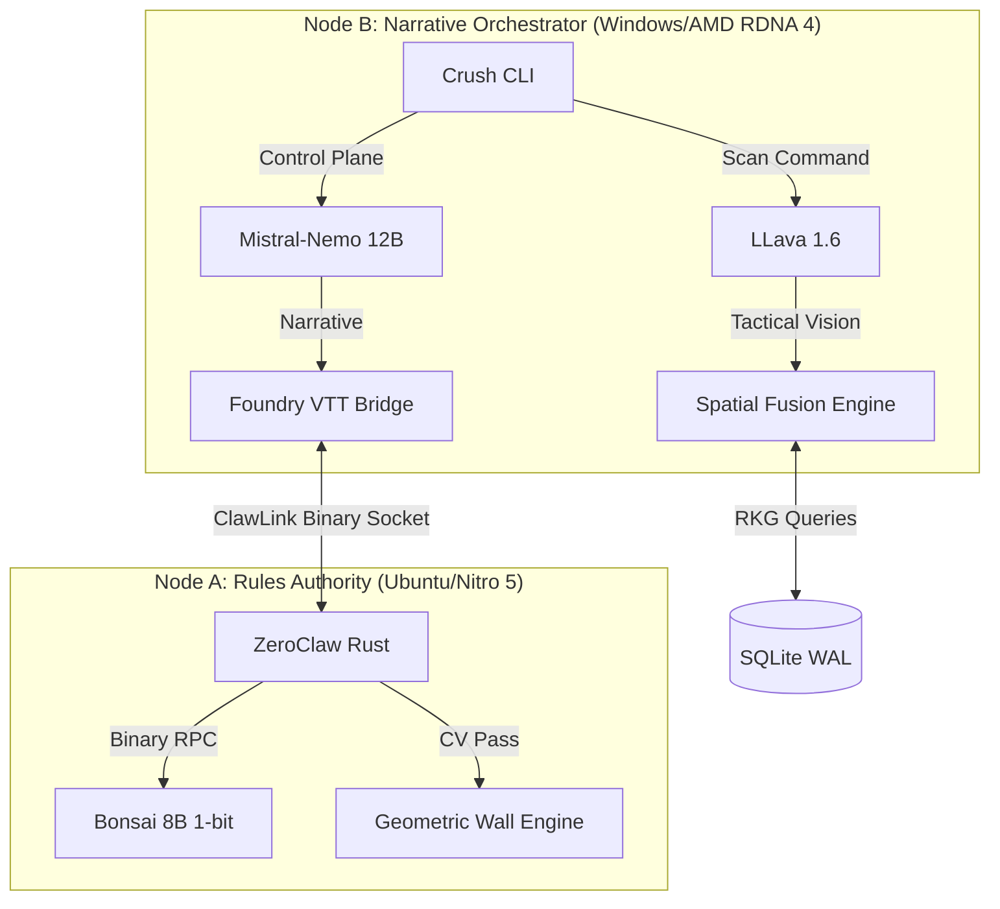

# ASP.GM-Agent (v0.9.2)
### High-Fidelity Split-Node TRPG Orchestration

ASP.GM-Agent is a high-performance, air-gapped platform designed for the deterministic orchestration of complex tabletop systems. Utilizing a dual-node hardware stack and a Rust-native rules authority, it provides sub-500ms narrative synthesis grounded in real-time map geometry and world-state cellular automata.

## ⚡ The Crush CLI: First-Class Control Plane
The **Crush CLI** is the primary interface for the AI GM. It bypasses traditional UI latency to provide direct, low-level access to the world engine:
- **`/scan`**: Triggers the Optical Bridge (Playwright + LLava) to ground the AI in map topology.
- **`/onboard`**: Orchestrates the Fixer Interview pipeline for real-time actor materialization.
- **`/pulse`**: Manually advances the deterministic world state (faction influence shifts).

## 🏗️ Hardware Architecture
- **Node A (Rules Authority):** Dedicated Linux co-processor running **ZeroClaw (Rust)**. It manages mathematical grounding using the 1-bit **Bonsai 8B** model, ensuring 100% adherence to the rules constitution.
- **Node B (Orchestrator):** Primary rig optimized for **RDNA 4 (Vulkan)**. Manages high-speed narrative synthesis and multi-modal tactical vision.

## 👁️ Project "Eyes-On"
The system utilizes a dual-node computer vision pipeline:
1. **Geometric Pass:** Node A extracts walls and portals via Rust-native Canny/Hough transforms.
2. **Semantic Pass:** Node B identifies cover, hazards, and security zones using multimodal LLM analysis.
3. **Spatial Fusion:** Real-time proximity lookups ground the AI's narrative in the map's physical topology.

## 📁 Repository Structure
- `/src`: TypeScript Orchestrator & Command Logic.
- `/zeroclaw`: Rust Rules Authority & Geometric CV.
- `/foundry-module`: Visual immersion bridge (supports Dice So Nice).
- `RED_RULES.md`: The Physics Constitution (Rules Invariants).

---
*Cyberpunk RED is a trademark of R. Talsorian Games. This project is a third-party architectural tool.*
