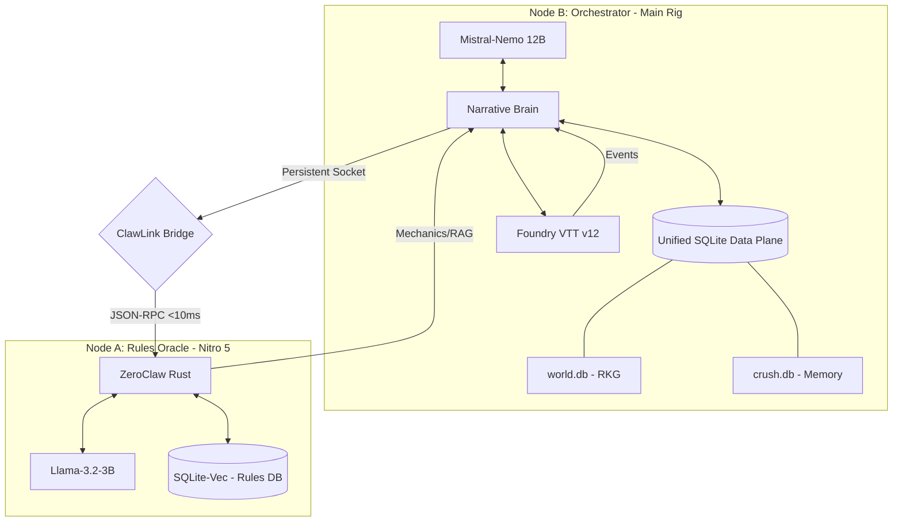

# ASP.GM-Agent (Project Black-Ice)
**Version:** 0.8.1 (Living City Simulation)
**Target:** Cyberpunk RED | Foundry VTT v12 | local-only

An industrial-grade, local-first Game Master orchestration suite for Cyberpunk RED. 

ASP.GM-Agent v0.8.1 moves away from traditional container overhead (Docker/PostgreSQL) in favor of a **Distributed Edge-Compute** architecture. It leverages a dual-node hardware cluster to maintain sub-10ms response times, total narrative grounding, and 100% air-gapped integrity.

## 🏗️ System Architecture: The Split-Node Stack

### Node A: The Rules Oracle (The Physics Engine)
* **Hardware:** Acer Nitro 5 (GTX 1050 Ti 4GB | Headless Ubuntu Server).
* **Engine:** **ZeroClaw** (Rust-native) running Llama-3.2-3B via Vulkan.
* **Storage:** **SQLite-Vec** (Rules-RAG & Mechanics Knowledge Base).
* **Role:** Acts as the deterministic judge for combat math, DV checks, and canon rule retrieval.

### Node B: The Narrative Brain (The Orchestrator)
* **Hardware:** Main Rig (Radeon 9060 XT 16GB | Windows/WSL2).
* **Engine:** **Mistral-Nemo 12B** (Q4_K_M) with **FP8 KV Cache** optimization.
* **Hosting:** Foundry VTT v12 + Crush CLI.
* **Storage:** **Unified Oracle MCP** (SQLite-backed Relational Knowledge Graph).
* **Role:** Handles high-fidelity prose generation, NPC dialogue, and global session state.

## ⚡ Core Pillars

### 1. Full-Stack SQLite Migration
The entire state—from 100+ hours of *Ticket To The Afterlife* mission data to individual PC/NPC inventory—is stored in project-local SQLite files. This eliminates "Network Tax" and ensures the narrative engine performs a **Verification Lookup** before every generated response.

### 2. The ClawLink Protocol
Communication between nodes utilizes **ClawLink**, a persistent, authenticated socket-over-SSH bridge. This replaces standard Stdio-over-SSH pipes, dropping tool-call latency from ~300ms to **<10ms**.

### 3. The Anti-Drift Engine (RKG)
To prevent "Narrative Drift," the system implements a **Relational Knowledge Graph** using a Triplet Schema (Subject-Predicate-Object) within `world.db`.
* **Deterministic Grounding:** The AI must query the SQLite state for NPC factions, locations, and health before narrating.
* **Global Inventory:** Real-time tracking of every item, mook, and contraband unit in the upcoming "Red Trade" economy.

### 4. VRAM Insurance
Node B utilizes native acceleration and FP8 quantization for the Key-Value (KV) cache, reducing the memory footprint by ~1.2GB. This ensures a stable 60 FPS in Foundry VTT while the 12B model maintains a 128k context window.

## 🛠️ Data Injection Layers
The system is seeded with 1,437+ vector chunks covering:
* **Core Mechanics**: Deterministic math, difficulty values, and foundational rules.
* **Campaign Narrative**: Mission structures, narrative beats, and world lore.
* **Entity Knowledge**: Extensive libraries of actor stat blocks and faction data.

## 🚀 Project Status
* **Current Version:** v0.8.3 (Phase 5 Complete).
* **Active Milestone:** Phase 6 (The Living City).
* **Environment:** Strictly Local / Air-Gapped / Zero-Telemetry.
* **Interface:** Integrated via Gemini CLI and Crush CLI.
nd Crush CLI.
