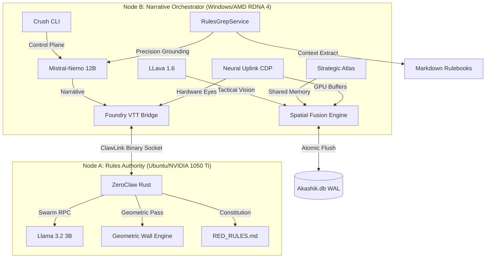

# ASP.GM-Agent (v1.1.2)
### The High-Fidelity Split-Node World Engine

ASP.GM-Agent is a production-grade, air-gapped platform designed for the deterministic orchestration of living tabletop environments. Utilizing a dual-node hardware stack and a native Neural Uplink, it provides sub-500ms narrative synthesis grounded in hard-coded physics, raw pixel perception, and the immutable Akashic Record.

## 🧠 v1.1.2: The Neural Uplink Release

### 1. Neural Uplink (Hardware Perception)
Bypasses the standard API sandbox to grant the AI physical eyes on the game engine via the **Chrome DevTools Protocol (CDP)**.
- **Visual Grounding:** Captures raw GPU rendering buffers for 1:1 pixel parity with the GM's screen.
- **Inversion Engine:** Injects real-time CSS overrides and narrative glitch FX directly into the Electron renderer.
- **Ghost-Refresh:** programmatically reloads the Foundry window to activate module updates without manual intervention.

### 2. The Akashic Record (Universal Truth)
Transitioned the primary data plane from a local file to the **Akashik.db** universal library.
- **Deterministic Governance:** Locks SQLite derivations (R*Tree, FTS5) via **Nix** to prevent index drift.
- **Vision History:** Stores visual hashes of every tactical state for persistent spatial grounding.

### 3. Strategic Atlas & Swarm Oracle
- **Zero-Latency Radar:** A Rust-native sidecar window using **Shared Memory (Option C)** for sub-microsecond state sync.
- **Task-Isolated Math:** Node A spawns concurrent "Faction Threads" to prevent stat-drift in multi-party combat.

## 🏗️ Technical Architecture
- **ClawLink:** Persistent TCP binary sockets with <10ms latency and serializing **Throttling Queue**.
- **Rules Vault:** Rust-native ZeroClaw sandboxed via **Nix + Bubblewrap** (100% air-gapped).
- **Control Plane:** Lipgloss-refit **Crush CLI** with 2-of-2 human authorization mandates.

## ⚡ Key Commands
- **`/scan`**: Initialize the dual-pass vision pipeline (Geometric + Semantic).
- **`/pulse`**: Advance the deterministic world state in Akashik.db.
- **`/onboard`**: Orchestrate characterized actor materialization.

---
*Cyberpunk RED is a trademark of R. Talsorian Games. This project is an independent architectural toolset.*
