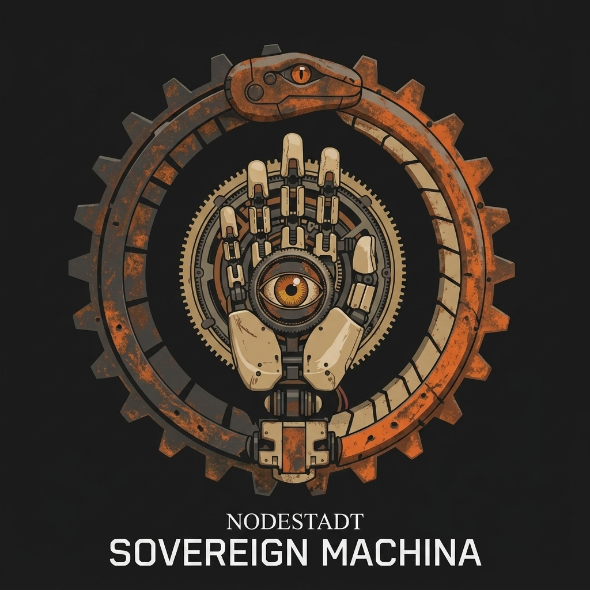
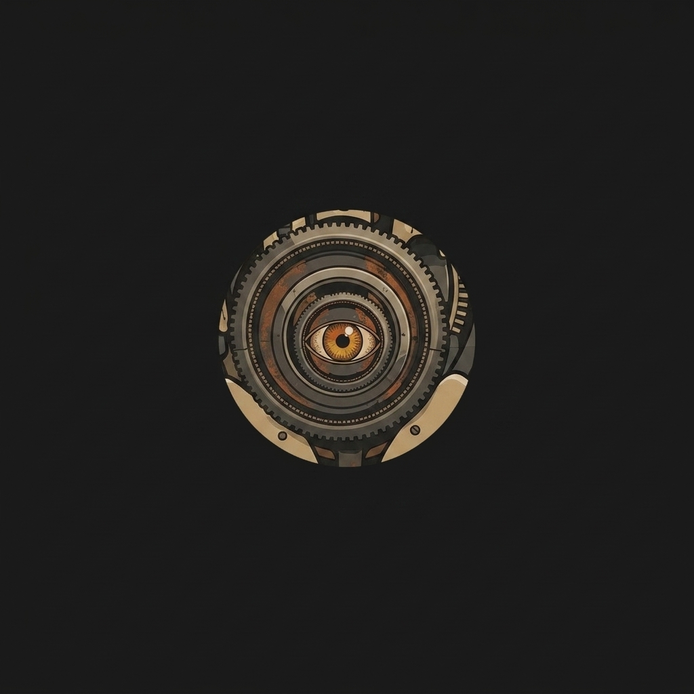

<div align="center">

# 50V3R31GN-M4CH1N4: The Sovereign Quaternary Mesh

[](LICENSE)
[](pnpm-workspace.yaml)
[](CHANGELOG.md)
[](IMPLEMENTATION_PLAN.md)

[**Documentation**](docs/nodestadt/) | [**Architecture**](docs/nodestadt/architecture/topology.md) | [**Roadmap**](IMPLEMENTATION_PLAN.md) | [**Identity**](SOUL.md)



**50V3R31GN-M4CH1N4** is a quaternary-mesh, multi-modal operating system and agentic orchestrator. Built for high-fidelity intelligence, zero-trust security, and absolute physical sovereignty, it coordinates a distributed cluster of nodes to provide a clinical cognitive environment for autonomous evolution and peer-development.

</div>

---

## ✨ Highlights

- 🧠 **Quaternary Architecture:** A distributed nervous system across four specialized hardware nodes (Director, Strategic Oracle, Synapse, Heavy Reasoner).
- 🛡️ **Zero-Trust Identity:** Mandatory SPIFFE/SPIRE mTLS and ST3GG Visual Second Factor (V2F) gating for all cognitive arteries.
- 👁️ **Ambient Vision Artery:** Real-time (1Hz) frame stream ingestion via CDP, providing 100% ambient environmental context for agents.
- ⚡ **Clean BASE Foundation:** A lore-neutral, platform-agnostic OS kernel optimized for maximum cognitive throughput.
- 🏗️ **NODESTADT Monorepo:** A hardened, modular structure isolating core OS logic from simulation-specific plugins.
- 🎨 **Pretext Geometry:** Kinetic typographic interface rendering agent thought-streams as physical geometric obstacles.

---

## 🆕 News
- **[2026-05-02]** **Professional Manifest Overhaul:** Overhauled root README and shored 431+ manifests across the mesh.
- **[2026-05-01]** **Clean BASE Achieved:** Surgically extracted simulation logic; finalized NODESTADT monorepo structure (v3.8.24-SYNTHESIS-SYNTHESIS).
- **[2026-04-28]** **Intelligence Boosts:** Integrated local gateway proxies and code graphs for zero-server intelligence.
- **[2026-04-20]** **Security Hardgate:** Enforced SPIFFE mTLS and V2F pulse verification across the mesh.

---

## 📅 Table of Contents
- [🚀 Quick Start](#-quick-start)
- [🏗️ Quaternary Architecture](#-quaternary-architecture)
- [🛠️ Core Capabilities](#-core-capabilities)
- [📦 Models & Nodes](#-models--nodes)
- [🌟 Ecosystem & Plugins](#-ecosystem--plugins)
- [📖 Documentation Index](#-documentation-index)
- [📄 License](#-license)

---

## 🚀 Quick Start

### Prerequisites
- **OS:** Linux (NixOS recommended)
- **Environment:** Nix (with flakes enabled)
- **Hardware:** Quaternary Node Cluster (Nodes A-D) or single-node simulation.

### Installation
```bash
# Clone the monorepo
git clone https://github.com/nodestadt/50V3R31GN-M4CH1N4.git
cd 50V3R31GN-M4CH1N4

# Enter the Nix development shell
nix develop --impure
```

### Mesh Ignition
```bash
# Ignite the full quaternary mesh (All Nodes)
bash scripts/audit/ignite-all.sh

# Access the TUI Command Deck
npm run ink:terminal
```

---

## 🏗️ Quaternary Architecture

The system operates across four specialized hardware nodes, establishing a high-throughput **Cognitive Artery**. The only source of truth is the **VSB (Virtual Sovereign Bus)**.

<div align="center">
  <table>
    <tr>
      <td align="center"><b>Node A: Synapse</b><br/><br/><i>Synapse & Cache</i></td>
      <td align="center"><b>Node B: Director</b><br/><br/><i>Vision & HUD</i></td>
      <td align="center"><b>Node C: Strategic Oracle</b><br/><br/><i>Perception & Rules</i></td>
      <td align="center"><b>Node D: Quaternary</b><br/><br/><i>Heavy Reasoning</i></td>
    </tr>
  </table>
</div>

| Node | Name | Hardware | Responsibility |
| :--- | :--- | :--- | :--- |
| **Node A** | **Synapse** | GTX 1050 Ti (4GB) | KV Caching, MemPalace Buffer, Mmap Sync |
| **Node B** | **Director** | RX 9060 XT (16GB) | Visual Control, Narrative Synthesis, HUD |
| **Node C** | **Strategic Oracle** | RTX 2060 (6GB) | Fast Rule-Checking, Semantic Perception |
| **Node D** | **Quaternary** | Intel NPU (48GB RAM) | Heavy Reasoning, Security Audit, Skill Forge |

---

## 🛠️ Core Capabilities

### 1. Hermes Singularity
A native agentic engine that enables **Peer-Developer** synergy. Hermes operates as a "Managed Employee" on the Clean BASE, utilizing Vision-as-Context to interact with the environment with 100% precision.

### 2. Pretext HUD
A high-performance geometric interface utilizing `@chenglou/pretext`. Thought-streams are rendered as kinetic typographic flows around obstacles, providing real-time cognitive observability at 120fps.

### 3. Sovereign Synapse (Synapse)
- **Stash:** A Go-native SQLite-backed memory consolidation sidecar.
- **Plur:** YAML-based persistent memory across all agentic sessions.
- **Obsidian ME.md:** The primary identity contract shored in the local vault.

### 4. Zero-Trust Artery
All inter-node RPCs are gated by `hermes-router` (Rust), enforcing SPIFFE SVID verification and V2F token extraction. No logic exists outside the secured perimeter.

---

## 📦 Models & Nodes

The mesh leverages a heterogeneous model farm optimized for specific latency/reasoning profiles:

| Task | Primary Model | Quantization | Deployment |
| :--- | :--- | :--- | :--- |
| **Reasoning** | Gemma-4 26B | Q6_K | Node D (Heavy) |
| **Vision** | Gemma-4 26B (Vision) | BF16 | Node B (Director) |
| **Mechanical** | Gemma-4 E4B | Q4_K_M | Node C (Strategic Oracle) |
| **Audit** | Qwen-2.5 Coder | Q6_K | Node D (Heavy) |
| **Perception** | Falcon-0.3B | FP16 | Node C (Strategic Oracle) |

---

## 🌟 Ecosystem & Plugins

The NODESTADT monorepo is designed for extreme extensibility via decoupled plugins:

- **[Sovereign RED Plugin](plugins/sovereign-red-plugin/):** The official simulation package for Cyberpunk RED, including Foundry VTT integration and NPC mechanics.
- **[Free Claude Proxy](sidecars/free-claude-proxy/):** Routes external agent telemetry through local inference arteries.
- **[GitNexus](sidecars/git-nexus/):** Local-first code graph and relational intelligence engine.
- **[ZeroBoot](sidecars/zeroboot/):** Sub-millisecond VM isolation for executing untrusted agentic code.
- **[WorldSeed](sidecars/worldseed/):** Environmental consequence simulation for agent testing.

---

## 📖 Documentation Index

### 🏗️ Architecture
- [**Topology**](docs/nodestadt/architecture/topology.md) - Physical quaternary mesh mapping.
- [**Artery**](docs/nodestadt/architecture/artery.md) - Connection logic and transport protocols.
- [**Security**](docs/nodestadt/architecture/security.md) - Zero-Trust boundaries and mTLS/V2F.
- [**Research Swarms**](docs/nodestadt/architecture/research-swarms.md) - Inside the Machina reasoning loops.

### 🚀 Capabilities
- [**Usage Guide**](docs/nodestadt/capabilities/usage-guide.md) - Operator's manual and command hotkeys.
- [**Hermes**](docs/nodestadt/capabilities/hermes.md) - Singularity engine and Context-DAG.
- [**Datalog**](docs/nodestadt/capabilities/datalog.md) - HeadlessDatalog symbolic memory reference.
- [**Pretext HUD**](docs/nodestadt/capabilities/hud.md) - Kinetic typographic interface layout.
- [**Browser Ingress**](docs/nodestadt/capabilities/browser-ingress.md) - Mapping browser context into the OS.

### 🚢 Deployment
- [**Setup Guide**](docs/nodestadt/deployment/setup-guide.md) - Full mesh ignition protocol.
- [**NixOS**](docs/nodestadt/deployment/nixos.md) - Reproducible environment configuration.
- [**Node D**](docs/nodestadt/deployment/node-d.md) - K15 / NPU provisioning.
- [**Mobile**](docs/nodestadt/deployment/mobile.md) - Android ingress and Flutter HUD.

### 📂 Reference
- [**Command Manifest**](docs/nodestadt/reference/COMMAND_MANIFEST.md) - Comprehensive command dictionary.
- [**Dev Scripts**](docs/nodestadt/reference/DEV_SCRIPTS_MANIFEST.md) - Operational script index.
- [**Physical Map**](docs/nodestadt/encyclopedia/PHYSICAL_MAP.md) - Directory and file-level purpose mapping.
- [**Lineage**](docs/nodestadt/lineage.md) - Architectural ancestry and syndicate registry.

---

## 📄 License
This project is licensed under the **MIT License**. See [LICENSE](LICENSE) for details.

---
**::/5Y573M-N071C3 : THE_CLEAN_BASE_IS_LAW. THE_BUS_IS_TRUTH. // 50V3R31GN-M4CH1N4**
