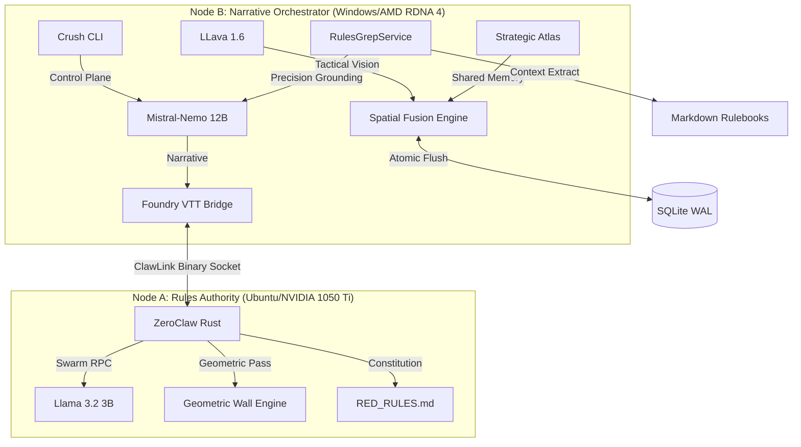

# ASP.GM-Agent (v1.1.0)
### The High-Fidelity Split-Node World Engine

ASP.GM-Agent is a production-grade, air-gapped platform designed for the deterministic orchestration of living tabletop environments. Utilizing a dual-node hardware stack and a task-isolated Rules Oracle, it provides sub-500ms narrative synthesis grounded in hard-coded physics and real-time map topology.

## 🧠 v1.1.0: The Unified Cyberdeck Release

### 1. Strategic Atlas (Zero-Latency Sidecar)
A standalone Rust binary (`sidecar-atlas`) that provides a real-time tactical radar of Night City.
- **Option C Transport:** Utilizes a **4MB Shared Memory segment** for sub-microsecond state synchronization between Node B and the UI.
- **Hardware Sovereignty:** Consumes <1% CPU and <50MB RAM, preserving the VRAM buffer for narrative inference.

### 2. The Night City Dashboard (Foundry Sidebar)
A persistent, high-density terminal integrated directly into the Foundry VTT sidebar.
- **Visual Identity:** Total unification with the **Black-Ice Cyan/Black** aesthetic.
- **Live Sync:** Real-time ASCII bars for PC/NPC vitality and a 10x10 heat-map of faction influence.

### 3. Crush CLI: Lipgloss Refit
The low-level control plane has been overhauled using the **Charmbracelet Lipgloss** ecosystem. 
- **Reactive UI:** Bordered terminal panes and CRT-glow emulation provide a seamless visual link between the CLI and the virtual tabletop.

### 4. Swarm Oracle & Flush Gate (Hardened)
- **Task Isolation:** Node A spawns isolated "Faction Threads" for concurrent rules reasoning.
- **2-of-2 Authorization:** Every world-state write (NPC death, faction shift) physically pauses for a human `ACK` signature in the terminal.

## 🏗️ Hardware Architecture
- **Node A (Rules Authority):** NVIDIA-native **CUDA** path ensuring zero-lag mathematical grounding on 4GB hardware.
- **Node B (Director):** Optimized for **AMD RDNA 4 (Vulkan)** with a **32k context window** via `q4_0` KV-caching.

## ⚡ Key Commands
- **`/scan`**: Initialize the dual-pass vision pipeline (Geometric + Semantic).
- **`/pulse`**: Advance the deterministic world state.
- **`/onboard`**: Orchestrate characterized actor materialization.

---
*Cyberpunk RED is a trademark of R. Talsorian Games. This project is an independent architectural toolset.*
