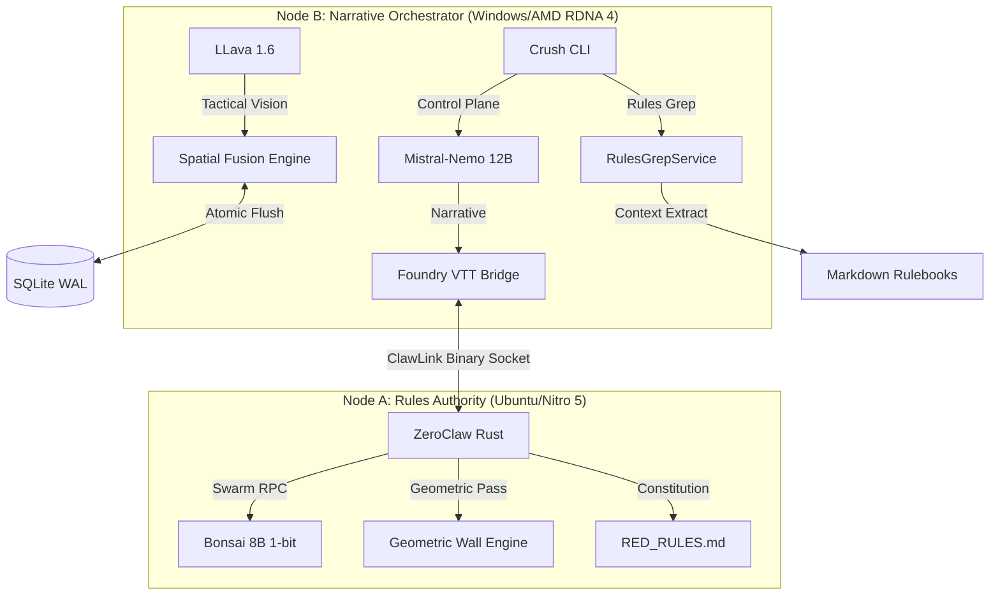

# ASP.GM-Agent (v1.0.1)
### The High-Fidelity Split-Node World Engine

ASP.GM-Agent is a production-grade, air-gapped platform designed for the deterministic orchestration of living tabletop environments. While originally developed for **Cyberpunk RED**, v1.0.0 has evolved into a robust, multi-threaded "World Engine" capable of simulating complex faction dynamics, spatial tactical awareness, and atomic world-state persistence.

## 🧠 v1.0.0: The High-Fidelity Features

### 1. The Swarm Oracle (Task-Isolated Reasoning)
Refactoring the Rules Oracle from a singular responder into a **Swarm Architecture**. Node A now utilizes `tokio::spawn` to spin up ephemeral "Faction Threads" for concurrent math resolution. 
- **Faction Isolation:** Prevents "stat-drift" or cross-talk between different combat parties (e.g., Maelstrom vs. NCPD).
- **Hard Grounding:** Every thread is anchored by the `RED_RULES.md` Physics Constitution before a single token is generated.

### 2. Context Compaction (Search-and-Extract)
Replaces broad, expensive vector RAG with precision **Streaming Extraction**.
- **RulesGrepService:** Instead of stuffing entire rulebooks into the LLM context, the `crush` CLI performs a high-speed grep over local Markdown files.
- **Precision Grounding:** Only the exact table row or rule definition (e.g., "Heavy Pistol DV Chart") is piped into the prompt, ensuring 100% mechanical accuracy with zero context bloat.

### 3. The Flush Gate (Atomic Persistence)
Implements a transactional barrier in the **Unified Oracle** to ensure world-state integrity under high load.
- **IMMEDIATE Transactions:** Pulse Engine heartbeats (faction strength shifts, NPC agenda updates) are executed as atomic units.
- **Crash-Safe Simulation:** The "Flush Gate" ensures the city's state never drifts into an inconsistent or corrupted data-plane.

### 4. Project "Eyes-On" (Multi-Modal Vision)
A dual-pass CV pipeline that grants the AI spatial awareness of the battle map.
- **Geometric Pass (Node A):** Rust-native Canny/Hough transforms identify physical walls and portals.
- **Semantic Pass (Node B):** LLava 1.6 identifies cover types, hazards, and security zones.
- **Spatial Fusion:** Real-time proximity lookups ground the AI's narrative in the map's topology.

## 🏗️ Technical Architecture
- **ClawLink (Binary Transport):** Persistent TCP binary sockets with <10ms latency.
- **Rules Authority (Rust):** High-performance co-processor grounding **Llama 3.2 3B** logic in the Physics Constitution.
- **Narrative Orchestrator (TypeScript):** Primary controller managing high-speed narrative synthesis (**Mistral-Nemo 12B**) and world heartbeat.

## ⚡ The Crush CLI
The **Crush CLI** is the system's low-level control plane, providing direct access to the world engine:
- **`/scan`**: Initialize the dual-pass vision pipeline.
- **`/pulse`**: Advance the deterministic world state.
- **`/onboard`**: Orchestrate characterized actor materialization.

---
*Cyberpunk RED is a trademark of R. Talsorian Games. This project is an independent architectural toolset.*
