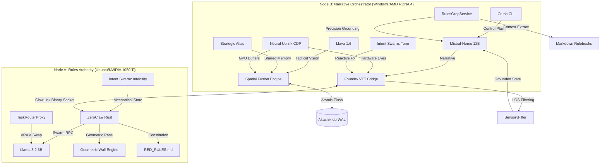

# ASP.GM-Agent (v1.6.0)
### The Neural Hive

ASP.GM-Agent is a production-grade, air-gapped platform designed for the deterministic orchestration of living tabletop environments. Utilizing a dual-node hardware stack and a native Neural Uplink, it provides sub-500ms narrative synthesis grounded in hard-coded physics, raw pixel perception, and the immutable Akashik Record.

## 🧠 v1.6.0: The Neural Hive (Current)

### Phase 18: Omni Orchestrator (Completed)
The Omni Orchestrator establishes a reactive, hardware-aware control plane for high-fidelity TRPG automation:
- **TaskRouterProxy:** Intelligent VRAM management for Node A. It manages model swapping by queuing "Light" tasks (Math, OCR, simple rules checks) when Node A is busy swapping high-parameter vision models, preventing RPC bottlenecks.
- **SensoryFilter:** Hard-coded perception grounding. It utilizes Foundry's native Line-of-Sight (LOS) polygon engine to filter the world-state data sent to the AI, ensuring it only "sees" what its token can physically perceive.
- **Intent Swarm:** Concurrent intent classification. Node B (AMD) determines narrative **Tone**, while Node A (NVIDIA) calculates mechanical **Intensity**, fusing them into reactive environmental effects and lighting in real-time.

### Phase 19: Concurrent Swarm Intelligence (In Progress)
Phase 19 introduces high-fidelity reactive NPC autonomy:
- **Autonomous NPC Turn Logic:** Distributed decision-making using 5s JSON rigid schemas for near-instant tactical response.
- **Tactical Swarm Simulation:** Concurrent multi-agent combat synthesis on Node A, preventing narrative stat-drift.
- **Narrative Hive Mind:** Context-aware behavioral mapping on Node B, grounding NPC intent in the district-aware world state.
- **Real-time Feedback Loop:** Bidirectional state synchronization with the Foundry Client for fluid physical-narrative fusion.

## 🧠 v1.5.0: The Omni-Sovereignty Release (Previous)
- **Phase 15-17:** Established the Bridge Evolution, Semantic Perception, and Layout Sovereignty core systems.

## 🧠 v1.3.0: The Neural World Engine (Previous)

### Phase 14: Environmental Reactivity & Persistence
Phase 14 introduces physical reactivity to the tabletop:
- **Visual Diff Engine:** Pixel-level scene perception via buffer comparison, extracting token bounding boxes and environmental changes in <5ms per 1080p frame.
- **Action-Conditioned Decals:** Neural-stamped environmental damage (bullet holes, scorch marks, blood splatter) injected as persistent drawing objects via CDP with 100% injection safety.
- **Latent Atmosphere Persistence:** Captures and restores location "soul" (lighting, darkness, animations) across session boundaries via `scene_atmosphere` table in Akashik.db.

All subsystems hardened through concurrency stress tests and storage validation. Production-ready.

## 🧠 v1.2.0: The Infinite Night Release (Previous)

### Phase 13: Procedural Engine Completion
Phase 13 establishes three core procedural systems:
- **Custom Map Ingestion Engine:** Autonomous chokidar-driven asset indexing with Node A geometric validation and atomic `Akashik.db` writes.
- **Mission Swarm Orchestrator:** Concurrent rules_intel + tactical oracle dispatch with district-aware lore anchoring via `crush.db` session history.
- **Neural Painter:** Single-pass Chrome DevTools Protocol batch materialization for walls, lights, and tokens with full injection safety.

All subsystems tested and production-ready.

### v1.1.2: The Neural Uplink Release (Previous)

#### 1. Neural Uplink (Hardware Perception)
Bypasses the standard API sandbox to grant the AI physical eyes on the game engine via the **Chrome DevTools Protocol (CDP)**.
- **Visual Grounding:** Captures raw GPU rendering buffers for 1:1 pixel parity with the GM's screen.
- **Inversion Engine:** Injects real-time CSS overrides and narrative glitch FX directly into the Electron renderer.
- **Ghost-Refresh:** programmatically reloads the Foundry window to activate module updates without manual intervention.

#### 2. The Akashik Record (Universal Truth)
Transitioned the primary data plane from a local file to the **Akashik.db** universal library.
- **Deterministic Governance:** Locks SQLite derivations (R*Tree, FTS5) via **Nix** to prevent index drift.
- **Vision History:** Stores visual hashes of every tactical state for persistent spatial grounding.

#### 3. Strategic Atlas & Swarm Oracle
- **Zero-Latency Radar:** A Rust-native sidecar window using a **Direct Shared Memory Interconnect** for sub-microsecond state sync.
- **Task-Isolated Math:** Node A spawns concurrent "Faction Threads" to prevent stat-drift in multi-party combat.

## 🏗️ Technical Architecture
- **ClawLink:** Persistent TCP binary sockets with <10ms latency and serializing **Throttling Queue**.
- **Rules Vault:** Rust-native ZeroClaw sandboxed via **Nix + Bubblewrap** (100% air-gapped).
- **Control Plane:** Lipgloss-refit **Crush CLI** with 2-of-2 human authorization mandates.

## ⚡ Key Commands
- **`/scan`**: Initialize the dual-pass vision pipeline (Geometric + Semantic).
- **`/pulse`**: Advance the deterministic world state in Akashik.db.
- **`/onboard`**: Orchestrate characterized actor materialization.

---
*Cyberpunk RED is a trademark of R. Talsorian Games. This project is an independent architectural toolset.*
