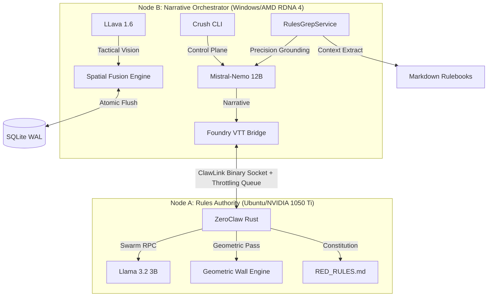

# ASP.GM-Agent (v1.0.4)
### The High-Fidelity Split-Node World Engine

ASP.GM-Agent is a production-grade, air-gapped platform designed for the deterministic orchestration of living tabletop environments. Utilizing a dual-node hardware stack and a task-isolated Rules Oracle, it provides sub-500ms narrative synthesis grounded in hard-coded physics and real-time map topology.

## 🧠 v1.0.4: Infrastructure Sovereignty Baseline

### 1. The 2nd Signature (Human-in-the-Loop)
Implements Vitalik’s **2-of-2 Authorization Model** for world-state writes. 
- **The Flush Gate:** Every database commit (NPC updates, faction shifts) now physically pauses and waits for an `ACK` or `ENTER` signature in the **Crush CLI**.
- **Drift Prevention:** Ensures the AI cannot autonomously mutate the RKG without human sign-off.

### 2. The Rules Vault (Nix Hardware Sandbox)
Node A is now a reproducible hardware vault defined by a **Nix Flake**.
- **VRAM Recovery:** Headless Nix derivation reclaims **~500MB VRAM** by stripping the OS GUI.
- **Bubblewrap Jailing:** The Rules Oracle is jailed with `--unshare-net`, physically isolating the AI from the internet while allowing local LAN handshakes.

### 3. Context Compaction (Search-and-Extract)
Replaces broad, expensive vector RAG with precision **Streaming Extraction**.
- **RulesGrepService:** The `crush` CLI performs a high-speed grep over local Markdown files to pull exact table rows (e.g., "Autofire DV Chart").
- **Zero-Bloat Prompts:** Only the necessary rule snippets are piped into the context, maintaining a pristine 32k context window.

### 4. Hardware-Optimized Dual-Path
The system utilizes native hardware languages to maximize performance:
- **Node A (CUDA):** NVIDIA-native path ensuring zero-lag mathematical grounding on 4GB hardware.
- **Node B (Vulkan):** Forced Vulkan path for AMD RDNA 4 (RX 9060 XT) to bypass ROCm discovery hangs.

## 🏗️ Technical Architecture
- **ClawLink:** Persistent TCP binary sockets with <10ms latency and serializing **Throttling Queue**.
- **Rules Engine:** Rust-native ZeroClaw grounding rules in 100% mathematical truth.
- **Data Plane:** SQLite WAL-mode with recursive triggers for deterministic world heartbeat.

## ⚡ The Crush CLI
The **Crush CLI** is the primary control plane:
- **`/scan`**: Initialize the dual-pass vision pipeline (Geometric + Semantic).
- **`/pulse`**: Advance the deterministic world state.
- **`/onboard`**: Orchestrate characterized actor materialization.

---
*Cyberpunk RED is a trademark of R. Talsorian Games. This project is an independent architectural toolset.*
